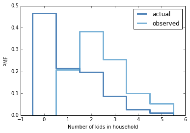

[Think Stats Chapter 3 Exercise 1](http://greenteapress.com/thinkstats2/html/thinkstats2004.html#toc31) (actual vs. biased)

This exercise explores the 'class size paradox' of biased data using the NSFG respondent data. This paradox occurs when members of a group are asked to report the size of the group. For a large group there will be many responses for the size of the large group but for a small group only a few responses. Therefore, it will appear that there are many more large groups than small groups.  

This exercise replicates this by using the 'NUMKDHH' variable, which reports the number of persons under the age of 18 in a household. The exercise asks to compare the differences in the unbiased original data and a newly created biased version of the data by comparing plots of the distributions and the distribution means.  

To solve this, I imported the necessary python libraries and the data set. I then declared the author's BiasPmf function, which biases an input PMF by multiplying the probability of each value by the value itself.  

For example, if households that reported having four children in the original data set had a PMF probability of 0.15, the biased probability will be 0.6 (4 * 0.15), thus making it four-times more likely to have a four-child household. This is equivalent to each child in the household reporting there are four children in the household, which is how the class size paradox comes about. The function then normalizes the new probabilities by the largest probability to make the probabilities fall between 0 and 1, as expected.

Then I plotted the original and biased PMF's and computed the mean of each to compare.  

My code is largely based off of the author's code in Chapter 3. 

---
```python
"""use author's provided code to import libraries and read in 
respondent data
"""
%matplotlib inline
import numpy as np

import nsfg
import first
import thinkstats2
import thinkplot

resp = nsfg.ReadFemResp() # read in respondent data

# author's function to bias the observed data
def BiasPmf(pmf, label):

    # copy original probability mass function and rename it
    new_pmf = pmf.Copy(label=label) 

    # multiply probability of x by x to make it x-times more likely
    for x, p in pmf.Items():
        new_pmf.Mult(x, x)
        
    # normalize new probabilities    
    new_pmf.Normalize()
    return new_pmf

# construct pmf for actual data
pmf = thinkstats2.Pmf(resp['numkdhh'], label='actual') 

# construct PMF using biased data
biased_pmf = BiasPmf(pmf, label='observed') 

# plot the two distributions
thinkplot.PrePlot(2)
thinkplot.Pmfs([pmf, biased_pmf])
thinkplot.Config(xlabel='Number of kids in household', ylabel='PMF')
```
---


---
```python
# compute the mean of each distribution
pmf.Mean()
biased_pmf.Mean()
```
---
```python
Actual mean: 1.0242051550438309
Biased mean: 2.4036791006642821
```
---
The plots of the two distributions shows the effect of biasing the original data quite well. The biased data shows households with more than one child are much more likely than the original data suggests. The step chart also does a nice job of showing that biased probabilities are in fact multiples of the actual probability. The biased probability for two-child households is about twice that of the actual data and three-child households are three-times as probable in the biased data set, and so on. Two interesting points are that the single-child household probability remains unchanged (multiplying by the identity) and the biased probability for no-child households drops to zero (multiplying by zero).  

The distribution means also show the effect of biasing. The mean of the original data is about 1.024 children per household but the biased mean is almost two and a half times that, 2.404.
