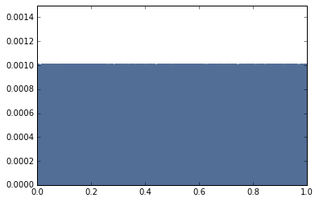

[Think Stats Chapter 4 Exercise 2](http://greenteapress.com/thinkstats2/html/thinkstats2005.html#toc41) (a random distribution)

This exercise asks to investigate numpy's random function to see if it generates truly random samples. To make the comparison the exercise asks to generate a random sample of 1000 values between 0 and 1 and plot the PMF and CDF of the distribution.

To complete this exercise I loaded in numpy and two of the author's libraries. I used numpy.random.random to generate a sample of 1000 values between 0 and 1. I then used the author's Pmf and Cdf functions to generate a PMF and CDF of the distribution. Finally, I used the author's thinkplot library to plot the two distributions.

---
```python
"""use author's provided code to import libraries
"""
%matplotlib inline

import numpy as np
import thinkstats2
import thinkplot

# generate a sample of 1000 values between 0 and 1
sample = np.random.random(1000)

# plot PMF of sample
rand_pmf = thinkstats2.Pmf(sample)
thinkplot.pmf(rand_pmf)
thinkplot.Config(ylim=[0,0.0015]) # extend y-axis to see dist. clearly
```
---
<!--insert pmf plot-->


---
```python
# plot CDF of sample
rand_cdf = thinkstats2.Cdf(sample)
thinkplot.Cdf(rand_cdf)
```
---


---
Plotting the PMF and CDF of the sample shows that the sample distribution is uniform. In the PMF, each value from 0 to 1 has an approximately equal probability, 0.0010, which corresponds to 1/1000. The CDF is linear with a slope of 1, which also shows uniformity. The sample is not perfectly random, as you can see small notches in the PMF and the CDF is not a perfectly straight line, but it is very nearly perfectly random.
